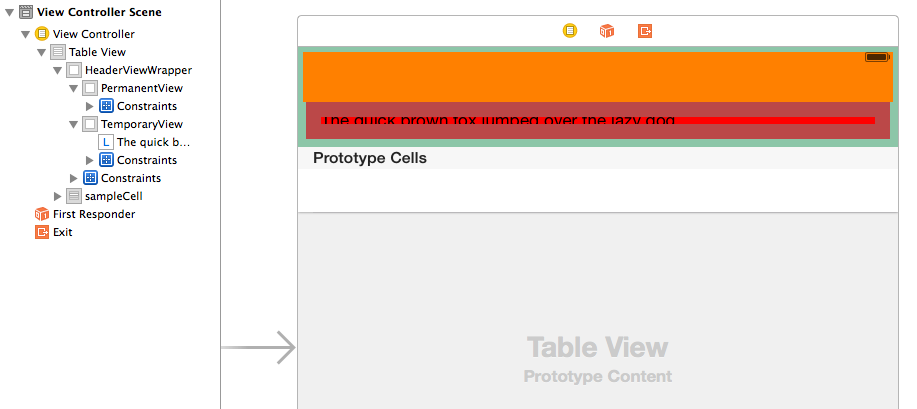
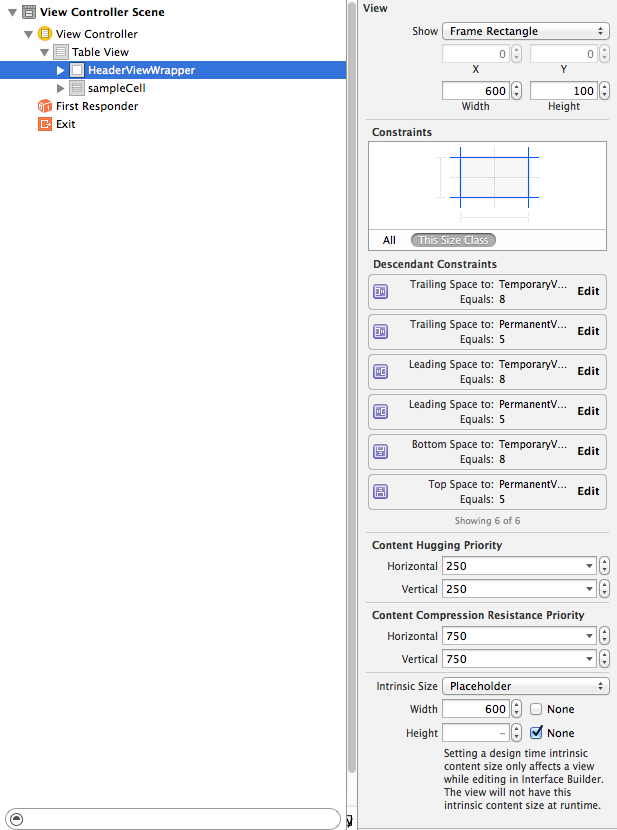
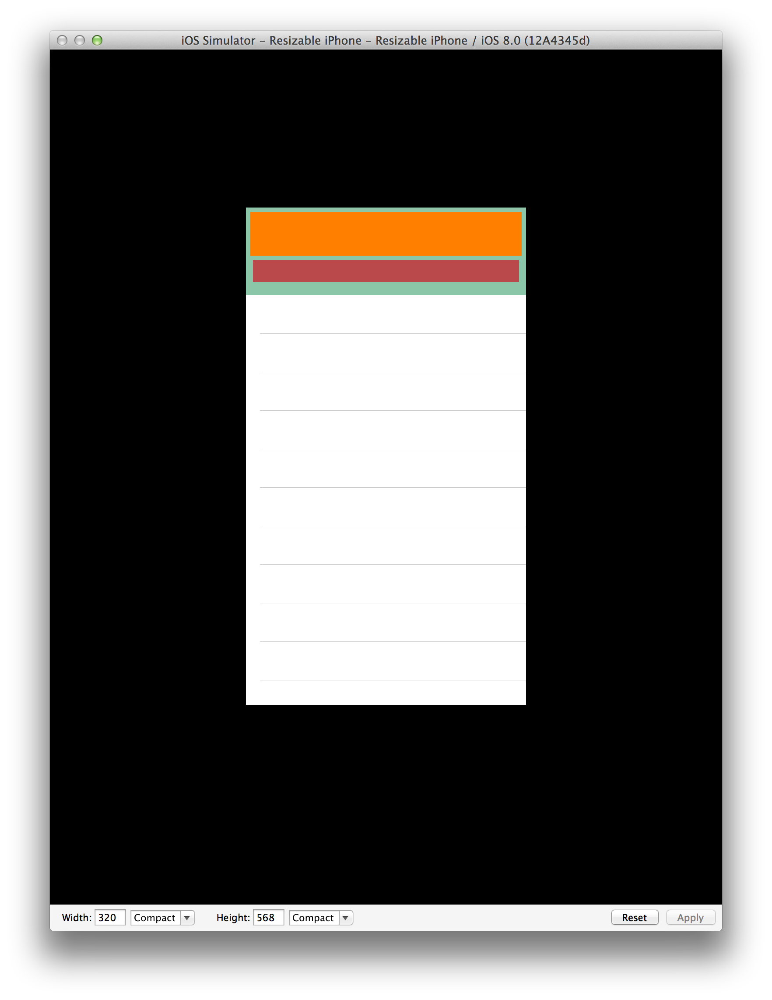
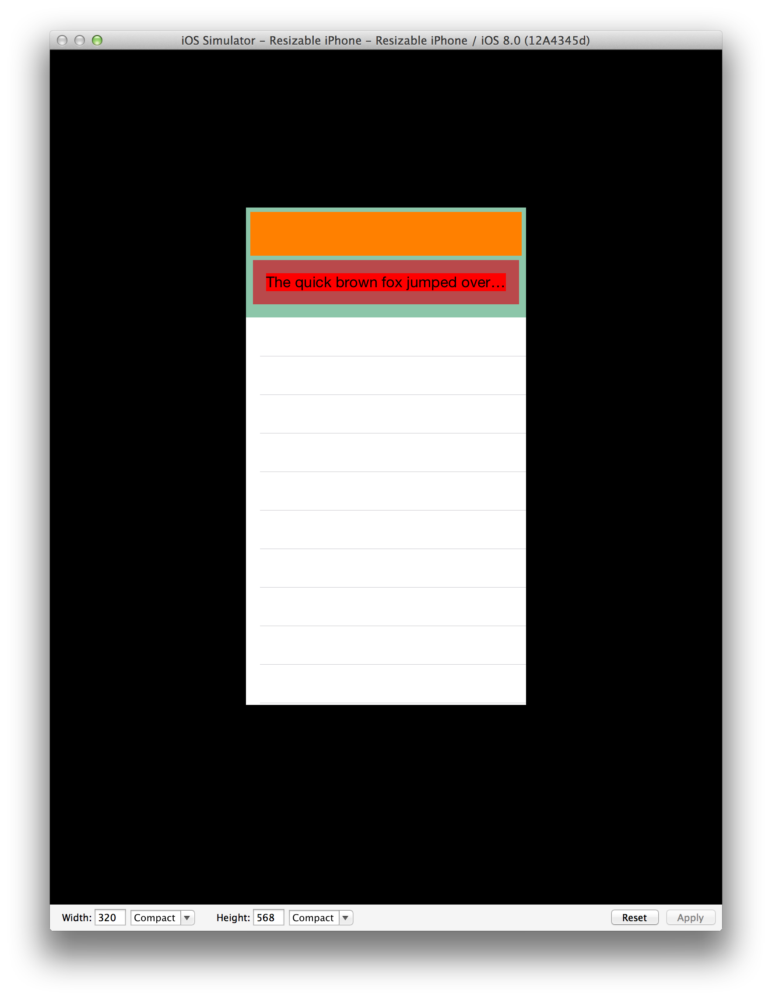
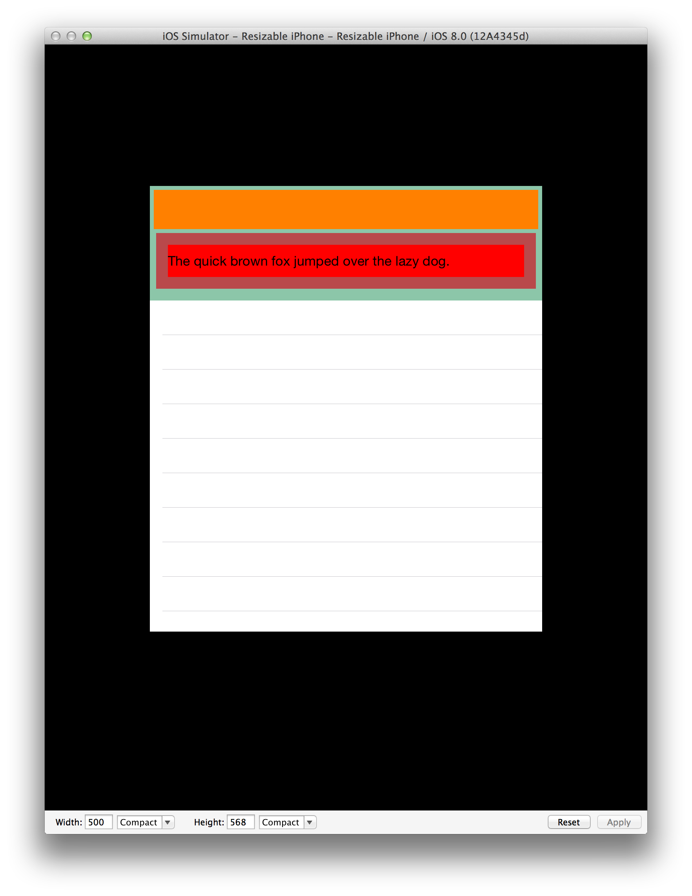
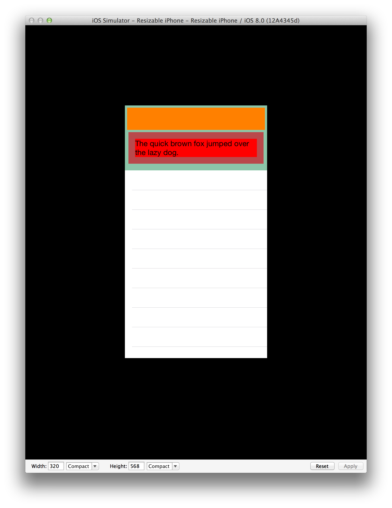
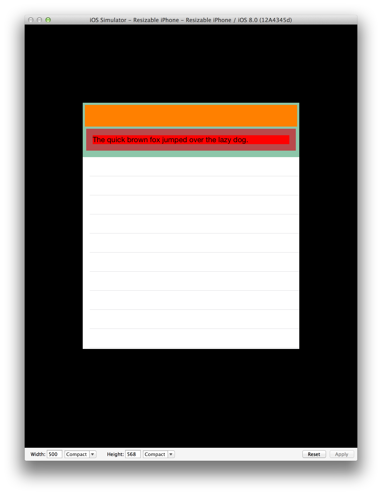

## TableViewHeader

A demonstration of the techniques required to have the storyboard-defined tableHeaderView of a UITableView have dynamic height and width using AutoLayout.

With a size-class enabled storyboard scene composed of a `UITableViewController` (or `UITableView` inside a `UIViewController`), drag a `UIView` such that it is above the first prototype cell. Arrange other views, including a UILabel within subviews. And define appropriate autolayout constraints such that these views should resize appropriately in the Resizeable Simulator.



The text of the `UILabel` is such that with a wide screen the text should fit on one line, but should wrap to two lines on a 320 point wide device. The label is also configured for `0` lines, which should allow the label to automatically wrap to the number of lines needed.

One of the requirements of this sample is to hide or show the `TemporaryView` by adjusting the system of containts at runtime, and causing the `tableHeaderView` to be resized.

Because we are modifying the constraints at runtime, the entry point for applying these layout-affecting constraint changes is `- (void)updateViewConstraints`.

## Issue #1 – Fixed Height

A `UIView` added to a `UITableView` above the prototype cells gets treated as a `tableHeaderView` automatically, however the runtime `height` of this `tableHeaderView` is defined by the frame-rectangle of the view in the storyboard, even if the Intrinsic Size is defined to none.

e.g. In the following screenshot the Frame Rectangle is defined to have a height of `100`, and the Intrinsic Size Height is set to `None`. At runtime the height of this `tableHeaderView` will be `100` regardless of the constraints of the contents.



Note: Runtime inspection indicates that the `tableHeaderView` has `translatesAutoresizingMaskIntoConstraints` set to `YES`. This is unexpected.

At runtime the `NSAutoresizingMaskLayoutConstraints` triggered by the `translatesAutoresizingMaskIntoConstraints == YES` conflict with the system of constraints within the `tableHeaderView` and the runtime (non-deterministically?) discards one of the constraints, resulting in an undesirable layout.

```
2014-08-28 07:53:52.932 TableViewHeader[1659:4451505] Unable to simultaneously satisfy constraints.
	Probably at least one of the constraints in the following list is one you don't want. Try this: (1) look at each constraint and try to figure out which you don't expect; (2) find the code that added the unwanted constraint or constraints and fix it. (Note: If you're seeing NSAutoresizingMaskLayoutConstraints that you don't understand, refer to the documentation for the UIView property translatesAutoresizingMaskIntoConstraints) 
(
    "<NSLayoutConstraint:0x7f91b177fcb0 V:[UIView:0x7f91b177f6e0(50)]>",
    "<NSLayoutConstraint:0x7f91b1782970 V:[UILabel:0x7f91b177ff90'The quick brown fox jumpe...']-(15)-|   (Names: '|':UIView:0x7f91b177fec0 )>",
    "<NSLayoutConstraint:0x7f91b17829c0 V:|-(15)-[UILabel:0x7f91b177ff90'The quick brown fox jumpe...']   (Names: '|':UIView:0x7f91b177fec0 )>",
    "<NSLayoutConstraint:0x7f91b1782d00 V:|-(5)-[UIView:0x7f91b177f6e0]   (Names: '|':UIView:0x7f91b177f410 )>",
    "<NSAutoresizingMaskLayoutConstraint:0x7f91b17955c0 h=--& v=--& V:[UIView:0x7f91b177f410(100)]>",
    "<NSLayoutConstraint:0x7f91b1521b40 V:[UIView:0x7f91b177f6e0]-(5)-[UIView:0x7f91b177fec0]>",
    "<NSLayoutConstraint:0x7f91b1525360 V:[UIView:0x7f91b177fec0]-(15)-|   (Names: '|':UIView:0x7f91b177f410 )>"
)

Will attempt to recover by breaking constraint 
<NSLayoutConstraint:0x7f91b1782970 V:[UILabel:0x7f91b177ff90'The quick brown fox jumpe...']-(15)-|   (Names: '|':UIView:0x7f91b177fec0 )>
```



It was anticipated that the text "The quick brown fox jumped over the lazy dog." would be visible within the label, however it is not because of the constraint `"<NSAutoresizingMaskLayoutConstraint:0x7f91b17955c0 h=--& v=--& V:[UIView:0x7f91b177f410(100)]>"`.

## Workaround #1

A technique to workaround the fixed-height of the `tableHeaderView` is to send `systemLayoutSizeFittingSize:UILayoutFittingCompressedSize` to the `tableHeaderView` to calculate the compressed height and manually update the view's frame. This is accomplished using the following method (called within `- (void)updateViewConstraints`. 

```
- (void)sizeHeaderToFit {
    UIView *header = self.tableView.tableHeaderView;
    
    [header setNeedsLayout];
    [header layoutIfNeeded];
    
    CGSize headerSize = [header systemLayoutSizeFittingSize:UILayoutFittingCompressedSize];
    CGFloat height = headerSize.height;
    CGRect frame = header.frame;
    
    frame.size.height = height;
    header.frame = frame;
    
    self.tableView.tableHeaderView = header;
}
```

This results in the following layout, but the conflicting constraints from above still exist.



Note: Because we are using size classes to support adaptive layout `preferredMaxLayoutWidth` is set to automatic. 

If `preferredMaxLayoutWidth` is set to a value for a specific display width, we get a suitable layout, but *only* for that specific display width.

e.g. Changing the `preferredMaxLayoutWidth` to `270` and using a `320` point width simulator, we get the following layout.


Changing the resizable simulator width to `500` we get the following layout.



At first glance this looks appropriate, except that the height of the label (bright red background) is sized as though it should contain two lines, even though it is layed out to use just one. (The padding above and below the single line of text is more than it should be.)

We have no intention of updating `preferredMaxLayoutWidth` at runtime to contain a correct value and instead will continue by setting it back to automatic.

## Issue #2 – Conflicting Constraints

With `preferredMaxLayoutWidth` is set to automatic and using `-sizeHeaderToFit` the layout looked correct, however there were layout conflicts with the constraint `"<NSAutoresizingMaskLayoutConstraint:0x7fe2a693b720 h=--& v=--& V:[UIView:0x7fe2a6b0b310(100)]>"`.

## Workaround #2

In order to avoid these conflicting constraints, at runtime we can use the following sequence.

1. Disable the `NSAutoresizingMaskLayoutConstraint` by setting `self.tableView.tableHeaderView.translatesAutoresizingMaskIntoConstraints = NO;`
2. Making our runtime constraint manipulations for the desired layout.
3. Call `-sizeHeaderToFit` to manually set the frame of the `tableHeaderView`
4. Reenable the `NSAutoresizingMaskLayoutConstraint` by setting `self.tableView.tableHeaderView.translatesAutoresizingMaskIntoConstraints = YES;`

Applying these changes avoids the conflicting constraints, but results in the following layout.


Unfortunately, the label still does not wrap the text as desired.

## Issue #3 Unconstrained Width

A side-effect of disabling the vertical `NSAutoresizingMaskLayoutConstraint` is that the horizontal `NSAutoresizingMaskLayoutConstraint` is also disabled. As such, if we examine the `headerSize` within `sizeHeaderToFit` we can see that for a `tableView` that is `320` wide, our compressed header size has a width of `405.5`.

```
(lldb) po self.tableView
<UITableView: 0x7fd85401fc00; frame = (0 0; 320 568); clipsToBounds = YES; autoresize = W+H; gestureRecognizers = <NSArray: 0x7fd853827550>; layer = <CALayer: 0x7fd853818f20>; contentOffset: {0, 0}; contentSize: {320, 125.5}>

(lldb) po headerSize
(width=405.5, height=125.5)
 {
  405.5

  125.5

}
```

It appears that because the horizontal `NSAutoresizingMaskLayoutConstraint` was disabled, the width of the `tableHeaderView` is no longer constrained, therefore an "automatic" setting for `preferredMaxLayoutWidth` is unbounded and results in a single-line label that is not properly wrapped.

## Workaround #3

In order to avoid having an unconstrained width, we need to set up a width constraint that mimics the `NSAutoresizingMaskLayoutConstraint` that we have disabled, but *leaving the height unconstrained*.

In the above sequence, we then insert a step 1.5 where we add a width constraint and remove it at step 3.5

### After Step 1
```
// Step 1.5
    CGFloat headerWidth = self.tableView. tableHeaderView.bounds.size.width;
    NSArray *temporaryWidthConstraints = [NSLayoutConstraint constraintsWithVisualFormat:@"[headerView(width)]" options:0 metrics:@{@"width": @(headerWidth)} views:@{@"headerView": self.headerView}];
    [self.headerView addConstraints:temporaryWidthConstraints];
```

### Before Step 4
```
// Step 3.5
    // now that we've coerced our headerView to lay out correctly, remove our temporary width contraint and reapply our autoresizeMaskConstraints
    [self.headerView removeConstraints:temporaryWidthConstraints];
```

With this set of changes the layout appears correctly for both a 320 width device and for a 500 width device.





## Summary

Without workarounds, the `tableHeaderView` does not allow its height to be defined by the constraints of its contents. The NSAutoresizingMaskLayoutConstraints that are defined for this view conflict with the height constraints of its content. Removing the NSAutoresizingMaskLayoutConstraints causes the width to be unbounded and necessitates applying a temporary width constraint to result in proper height calculation and width.

It is expected that the `tableHeaderView` height should be able to be determined at runtime automatically, equivalent to the automatic sizing of table view cells.